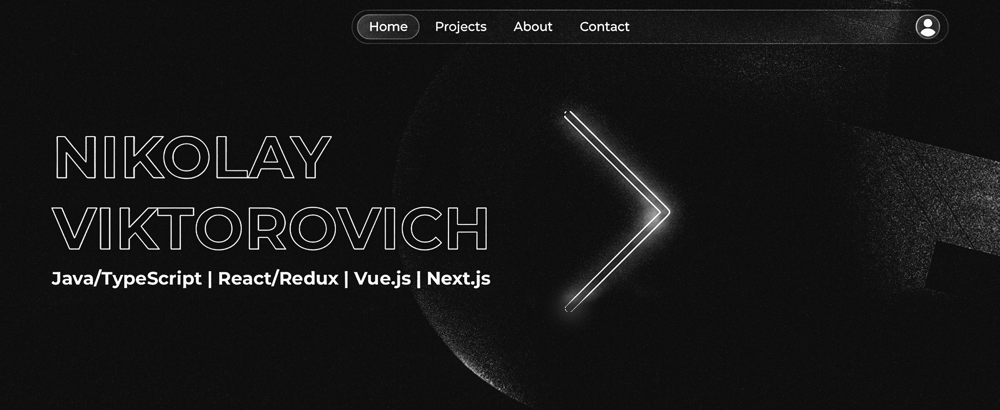

---

<h2>О себе</h2>

- Создаю производительные, адаптивные и кроссбраузерные веб-приложения с фокусом на **UX/UI** и **чистый код**.
- Специализируюсь на разработке современных интерфейсов, которые сочетают эстетику, удобство и высокую производительность.
- Победитель хакатона Сбера (кейс «Динамический планировщик образовательной траектории» для УрФУ).
- Основатель и разработчик проекта - [ghostproduceredm.com](https://ghostproduceredm.com/)

---

<h2>
   
  Технологический стек
</h2>

### Frontend Core

### Управление состоянием и данными

### Стилизация & UI

---

<h2>
   
  Ключевые компетенции
</h2>

<h3>Архитектура</h3>

- SPA & SSR приложения (React, Vue, Next.js)
- Микрофронтенды и модульная архитектура
- Design Systems и компонентные библиотеки

<h3>Разработка</h3>

- Адаптивная и семантическая вёрстка
- Типизация с TypeScript
- Интеграция REST API и GraphQL
- Работа с WebSocket и real-time данными
- Создание и интеграция собственных API

<h3>Командная работа</h3>

- code review
- Agile/Scrum методологии
- Менторинг junior разработчиков

---

<h2>
   
  GitHub Статистика
</h2>

