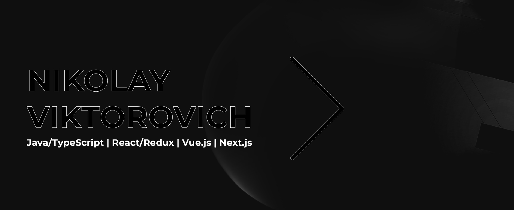

# ✨ Обо мне
Я **Николай**, Middle Frontend разработчик с 3+ года опыта создания современных, интерактивных и производительных веб-приложений. Специализируюсь на разработке адаптивных и кроссбраузерных интерфейсов. Моя страсть - создавать удобные и эстетичные решения, улучшающие пользовательский опыт.

# 🚀 Что я делаю

* 🔥 Frontend разработка (React, Vue, Next.js)
* 💡 Создание современных и интерактивных веб-интерфейсов
* 🛠️ Оптимизация приложений для высокой производительности
* 📈 Основатель и разработчик проекта: ghostproduceredm.com
* ⚡️ Пишу чистый, поддерживаемый код

# 💻 Технологический стек

# 🔧 Навыки
* **Frontend**: HTML, CSS (LESS/SASS), JavaScript (ES6+), TypeScript
* **Фреймворки**: React, Vue, Next.js
* **State Management**: Redux
* **Базы данных**: MongoDB, PostgreSQL
* **Инструменты**: Visual Studio Code, WebStorm
* **Работа с API**: REST API, GraphQL, Axios
* **Изучаю на данный момент базово C#**

---

## 💬 Свяжитесь со мной

  
  

 

<picture>
  <source media="(prefers-color-scheme: dark)" srcset="https://raw.githubusercontent.com/platane/snk/output/github-contribution-grid-snake-dark.svg" />
  <source media="(prefers-color-scheme: light)" srcset="https://raw.githubusercontent.com/Platane/snk/output/github-contribution-grid-snake.svg" />
  
</picture>
